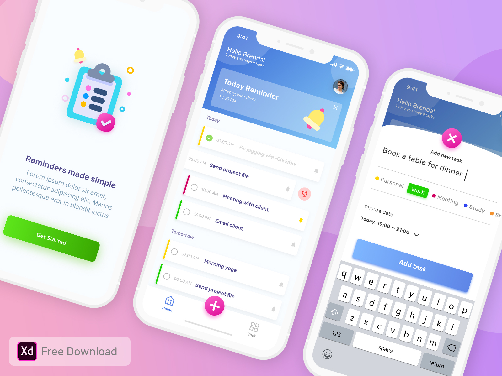
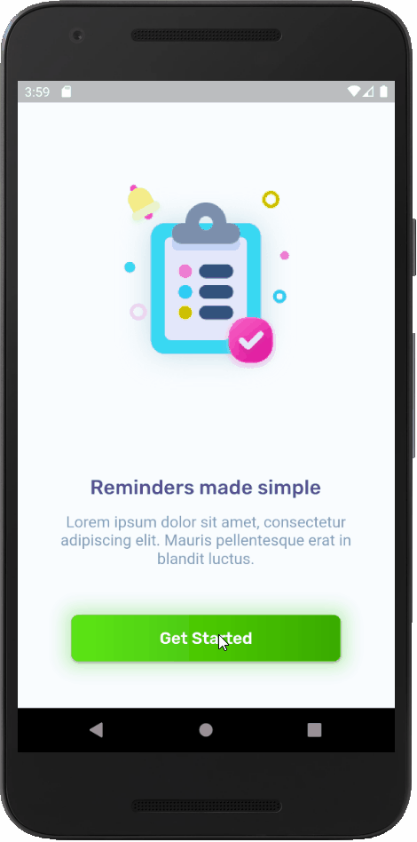
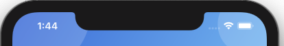

# ✔️ Flutter to do App "To Do List"

A Flutter app based on the design of the To Do App, created by *Rudi Hartono*, see more on: [Uplabs](https://www.uplabs.com/posts/to-do-list-app-freebie-kit).

## Getting Started 🚀

```shell
- Clone the repo
- Install the dependicies
- Run it
```

## Preview and Google Play

The app is based on Rudi's design:



The result is:



[](https://play.google.com/store/apps/details?id=com.interestinate.flutter_todolist)

## Version history

| Version |       Date         |             Comments             |
| ------- | ------------------ | -------------------------------- |
| 1.6     | May 19, 2021 | Migrate to Flutter 2 + Added Subtasks |
| 1.5     | December 10, 2019 | Changed build from prodcution to test |
| 1.4     | September 26, 2019 | Published the App on Google Play |
| 1.3     | September 24, 2019 | Added App-icons for deployment   |
| 1.2     | September 23, 2019 | Added swipe to delete:  |
| 1.1     | September 16, 2019 | Set the statusbar to transparent:  |
| 1.0     | ~September 2019    | Initial release                  |

## Contributing

Feel welcome and free to submit issues, pull requests and features to this repo.

## Support me

I really like to make as much (free) beautiful Flutter apps, so you get inspired!
Hence you can support me by:

⭐️ this repo if you like it.

[](https://paypal.me/jwalhout?locale.x=nl_NL)

Thank you in advanced 👍

## Other Flutter Apps

There are other example Apps made with flutter, see more on [Interestinate](https://interestinate.com).

Or the following repo's:
- An iOS focused Flutter App: [iSubscribe](https://github.com/LiveLikeCounter/Flutter-iSubscribe)
- A Package Manager App made with Flutter: [Package Manager](https://github.com/LiveLikeCounter/Flutter-Package-Manager)
- A Food Delivery Flutter App: [Food Delivery](https://github.com/LiveLikeCounter/Flutter-Food-Delivery)
- A Paypal Redesign made in Flutter: [Paypal Redesign](https://github.com/LiveLikeCounter/Flutter-Paypal-Redesign)